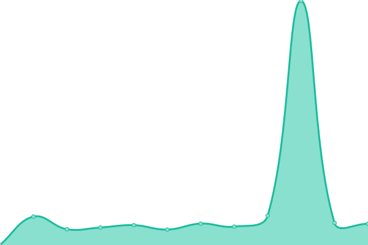
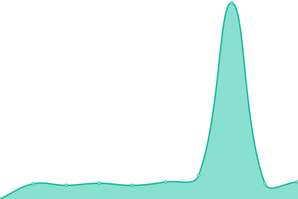
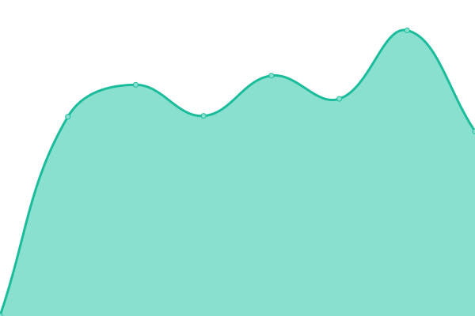

# [📈 Live Status](https://status.neurond.com): <!--live status--> **🟩 All systems operational**

This repository contains the open-source uptime monitor and status page for [Neurond-AI](https://status.neurond.com), powered by [Upptime](https://github.com/upptime/upptime).

With [Upptime](https://upptime.js.org), you can get your own unlimited and free uptime monitor and status page, powered entirely by a GitHub repository. We use [Issues](https://github.com/Neurond-AI/Status-NAv3/issues) as incident reports, [Actions](https://github.com/Neurond-AI/Status-NAv3/actions) as uptime monitors, and [Pages](https://status.neurond.com) for the status page.

<!--start: status pages-->
<!-- This summary is generated by Upptime (https://github.com/upptime/upptime) -->
<!-- Do not edit this manually, your changes will be overwritten -->
<!-- prettier-ignore -->
| URL | Status | History | Response Time | Uptime |
| --- | ------ | ------- | ------------- | ------ |
|  [Staging Assistant Neurond AI](https://staging-assistant.neurond.com/) | 🟩 Up | [staging-assistant-neurond-ai.yml](https://github.com/Neurond-AI/Status-NAv3/commits/HEAD/history/staging-assistant-neurond-ai.yml) | 

 1259ms
     
 | 

<a href="https://status.neurond.com/history/staging-assistant-neurond-ai">100.00%</a>
    

|  [Production Assistant Neurond AI](https://assistant.neurond.com/) | 🟩 Up | [production-assistant-neurond-ai.yml](https://github.com/Neurond-AI/Status-NAv3/commits/HEAD/history/production-assistant-neurond-ai.yml) | 

 1307ms
     
 | 

<a href="https://status.neurond.com/history/production-assistant-neurond-ai">100.00%</a>
    

|  [Production Assistant Atlas](https://ai.atlasindustries.com/) | 🟩 Up | [production-assistant-atlas.yml](https://github.com/Neurond-AI/Status-NAv3/commits/HEAD/history/production-assistant-atlas.yml) | 

 1363ms
     
 | 

<a href="https://status.neurond.com/history/production-assistant-atlas">100.00%</a>
    

<!--end: status pages-->

[**Visit our status website →**](https://status.neurond.com)

## 📄 License

- Powered by: [Upptime](https://github.com/upptime/upptime)
- Code: [MIT](./LICENSE) © [Anand Chowdhary](https://anandchowdhary.com), supported by [Pabio](https://pabio.com)
- Data in the `./history` directory: [Open Database License](https://opendatacommons.org/licenses/odbl/1-0/)
